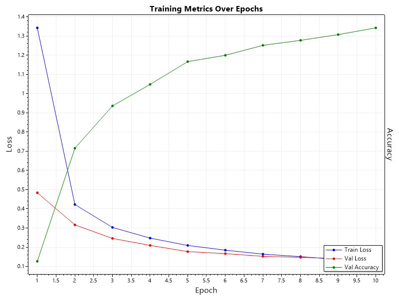
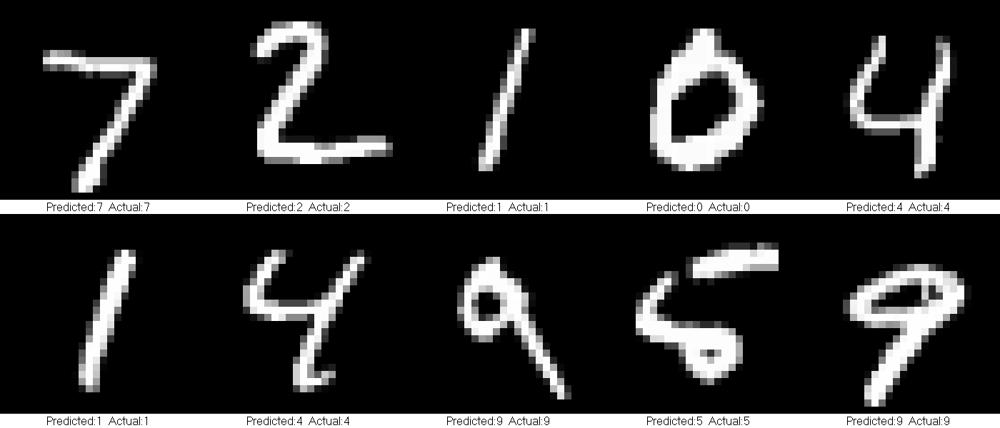

# 🧠 Neural Network from Scratch in C#

A **handwritten digit classification system** built entirely from scratch without any ML frameworks — demonstrating deep understanding of neural network fundamentals, backpropagation mathematics, and machine learning engineering principles.



##  Project Overview

This project implements a fully-functional **feedforward neural network** to classify handwritten digits from the [MNIST dataset](http://yann.lecun.com/exdb/mnist/) — achieving high accuracy on 10,000 test images. The entire implementation is built from first principles in C#, showcasing:

- **Mathematical foundations** of deep learning
- **Gradient computation** via chain rule (backpropagation)
- **Weight optimization** using stochastic gradient descent
- **Regularization techniques** to prevent overfitting

### Sample Predictions



---

##  Architecture & Implementation

### Neural Network Structure

```
Input Layer (784 neurons) → Flattened 28×28 pixel images
         ↓
Dense Layer (128 neurons) → Learned feature representations  
         ↓
ReLU Activation           → Non-linearity introduction
         ↓
Dropout (0.2)             → Regularization during training
         ↓
Dense Layer (64 neurons)  → Higher-level pattern recognition
         ↓
ReLU Activation           → Non-linearity
         ↓
Dense Layer (10 neurons)  → Output logits for each digit (0-9)
         ↓
Softmax + Cross-Entropy   → Probability distribution & loss
```

### Project Structure

```
MNIST_NeuralNetwork/
├── Model/
│   ├── NeuralNetwork.cs          # Core network: forward/backward pass, save/load
│   ├── Layers/
│   │   ├── Layer.cs              # Abstract base class for all layers
│   │   ├── DenseLayer.cs         # Fully-connected layer with weights & biases
│   │   ├── ActivationReLU.cs     # Rectified Linear Unit activation
│   │   ├── ActivationSoftmax.cs  # Softmax for probability normalization
│   │   └── Dropout.cs            # Regularization layer (training vs inference)
│   └── LossFunctions/
│       ├── ILossFunction.cs      # Interface for loss functions
│       └── CrossEntropyLoss.cs   # Categorical cross-entropy with softmax gradient
├── Data/
│   └── MnistLoader.cs            # Binary IDX file parser with normalization
├── Training/
│   └── Trainer.cs                # Epoch-based training loop with metrics tracking
├── Testing/
│   └── Tester.cs                 # Model evaluation on hold-out test set
├── Utils/
│   ├── Evaluator.cs              # Accuracy & loss computation
│   └── ArrayUtils.cs             # Array conversion utilities for serialization
└── Visualization/
    ├── Plotter.cs                # Training curves visualization (ScottPlot)
    └── ImageGridPlotter.cs       # Prediction grid renderer
```

---

## Key ML Concepts Demonstrated

### 1. Forward Propagation
Each layer transforms inputs via learned weights:
```csharp
// Dense Layer: y = Wx + b
for (int i = 0; i < OutputSize; i++)
{
    double sum = biases[i];
    for (int j = 0; j < InputSize; j++)
        sum += weights[i, j] * inputs[j];
    outputs[i] = sum;
}
```

### 2. Backpropagation (Gradient Descent)
Gradients flow backward via the chain rule, updating weights:
```csharp
// Compute gradient for previous layer & update weights
for (int i = 0; i < OutputSize; i++)
{
    for (int j = 0; j < InputSize; j++)
    {
        inputGradients[j] += gradients[i] * weights[i, j];
        weights[i, j] -= learningRate * gradients[i] * inputs[j]; // SGD update
    }
    biases[i] -= learningRate * gradients[i];
}
```

### 3. Xavier Weight Initialization
Prevents vanishing/exploding gradients at initialization:
```csharp
weights[i, j] = rand.NextDouble() * Math.Sqrt(1.0 / InputSize);
```

### 4. ReLU Activation
Introduces non-linearity while avoiding vanishing gradients:
```csharp
// Forward: max(0, x)
outputs[i] = Math.Max(0, inputs[i]);

// Backward: gradient passes through only if input > 0
inputGradients[i] = inputs[i] > 0 ? gradients[i] : 0;
```

### 5. Softmax + Cross-Entropy Loss
Converts logits to probabilities and measures classification error:
```csharp
// Softmax with numerical stability
double expVal = Math.Exp(inputs[i] - maxVal);
outputs[i] = expVal / sumExp;

// Cross-Entropy gradient (elegant simplification)
gradients[i] = softmaxPredictions[i] - targets[i];  // predicted - actual
```

### 6. Dropout Regularization
Randomly disables neurons during training to prevent co-adaptation:
```csharp
if (IsTraining)
{
    bool keepNeuron = rand.NextDouble() > dropoutRate;
    mask[i] = keepNeuron;
    outputs[i] = keepNeuron ? input[i] : 0.0;
}
else
    return input;  // No dropout during inference
```

### 7. MNIST Binary Format Parsing
Direct parsing of IDX file format with byte-order conversion:
```csharp
// Big-endian to little-endian conversion for cross-platform compatibility
int magic = ReverseInt32(reader.ReadInt32());
int numImages = ReverseInt32(reader.ReadInt32());

// Pixel normalization to [0, 1] range
imageData[j] = pixelBytes[j] / 255.0;
```

### 8. One-Hot Encoding
Converts categorical labels to probability vectors:
```csharp
// Label 7 → [0, 0, 0, 0, 0, 0, 0, 1, 0, 0]
var oneHotLabel = new double[numClasses];
oneHotLabel[label] = 1.0;
```

---

##  Technical Stack

| Component | Technology |
|-----------|------------|
| Language | C# (.NET 8.0) |
| Visualization | ScottPlot 4.1.74 |
| Dataset | MNIST (60K train / 10K test) |
| Serialization | System.Text.Json |

---

##  Integration Ready

This project is designed as a **class library** (`.dll`) for easy integration into backend applications, APIs, or microservices:

```csharp
// Load pre-trained model
var network = new NeuralNetwork(learningRate: 0.01, lossFunction: new CrossEntropyLoss());
network.Load("model.json");
network.setTrainingMode(false);

// Predict digit from 784-length pixel array
double[] prediction = network.Forward(normalizedPixelArray);
int predictedDigit = Array.IndexOf(prediction, prediction.Max());
```

---

##  Training Metrics

The training pipeline tracks:
- **Training Loss** — Model fit on training data
- **Validation Loss** — Generalization performance
- **Validation Accuracy** — Classification correctness
- **Epoch Time** — Training efficiency

All metrics are logged per epoch and visualized using ScottPlot.

---

##  Learning Outcomes

This project demonstrates mastery of:

| Concept | Implementation |
|---------|----------------|
| **Feedforward Networks** | Layer abstraction, modular architecture |
| **Backpropagation** | Chain rule, gradient flow, weight updates |
| **Activation Functions** | ReLU (training stability), Softmax (probabilities) |
| **Loss Functions** | Cross-entropy for multi-class classification |
| **Regularization** | Dropout for overfitting prevention |
| **Weight Initialization** | Xavier/Glorot for stable training |
| **Data Processing** | Binary format parsing, normalization, encoding |
| **Model Persistence** | JSON serialization of weights and architecture |

---

##  Pre-trained Model

A trained model is included (`model.json`) containing:
- All layer configurations (types, dimensions)
- Learned weights and biases for each dense layer
- Dropout rates for regularization layers

---

##  License

MIT License — Feel free to use, modify, and learn from this implementation.

---

<div align="center">

**Built from first principles to demonstrate genuine understanding of neural network fundamentals.**

*No TensorFlow. No PyTorch. No Keras. Just math.*

</div>
